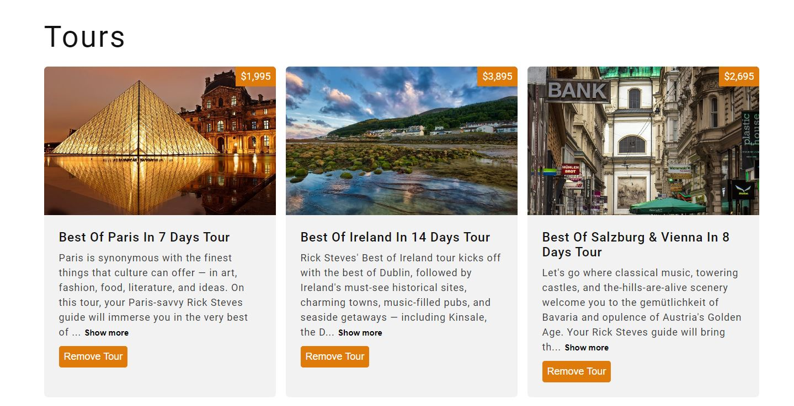

## React Tours Project

### Project URL: https://react-tours-project-112.netlify.app/

### Key Features:

- Fetching tour data from external source/URL.
- Map over tour array and render components for each tour.
- Filtering tours with the use of 'Remove tour' button (by updating React state).
- Re-fetching all tours data from external source/URL.

